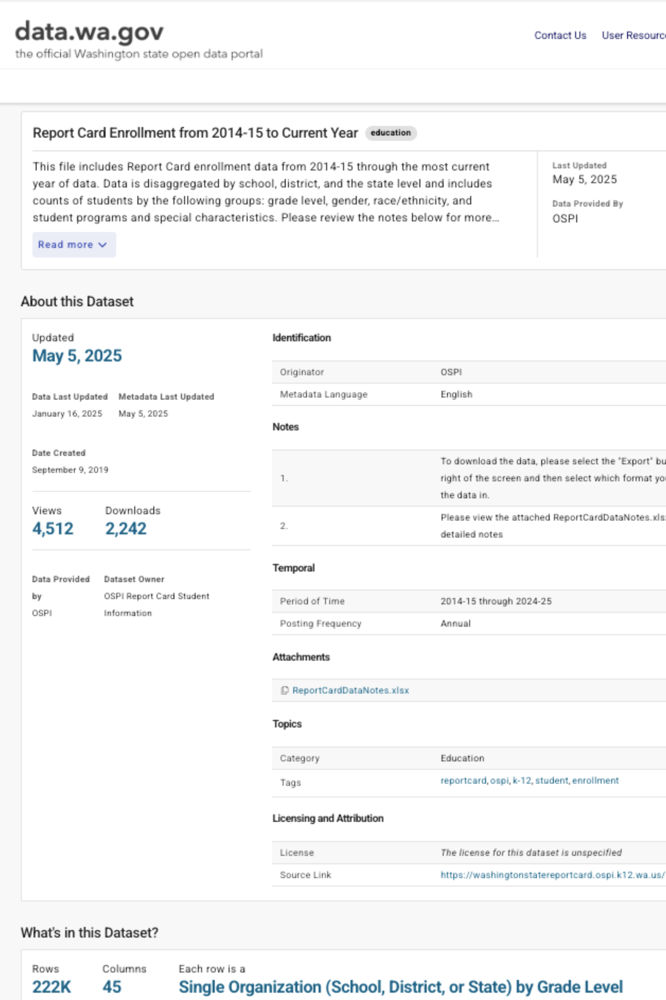
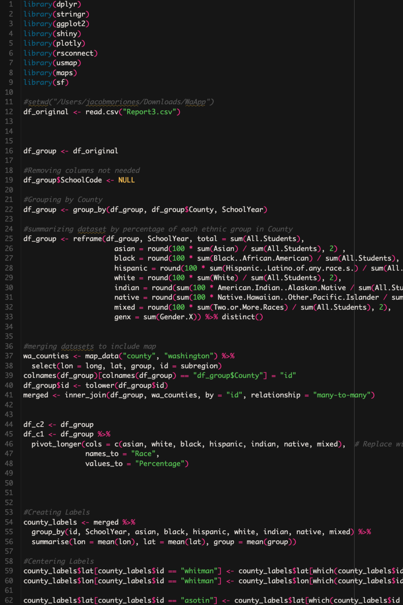
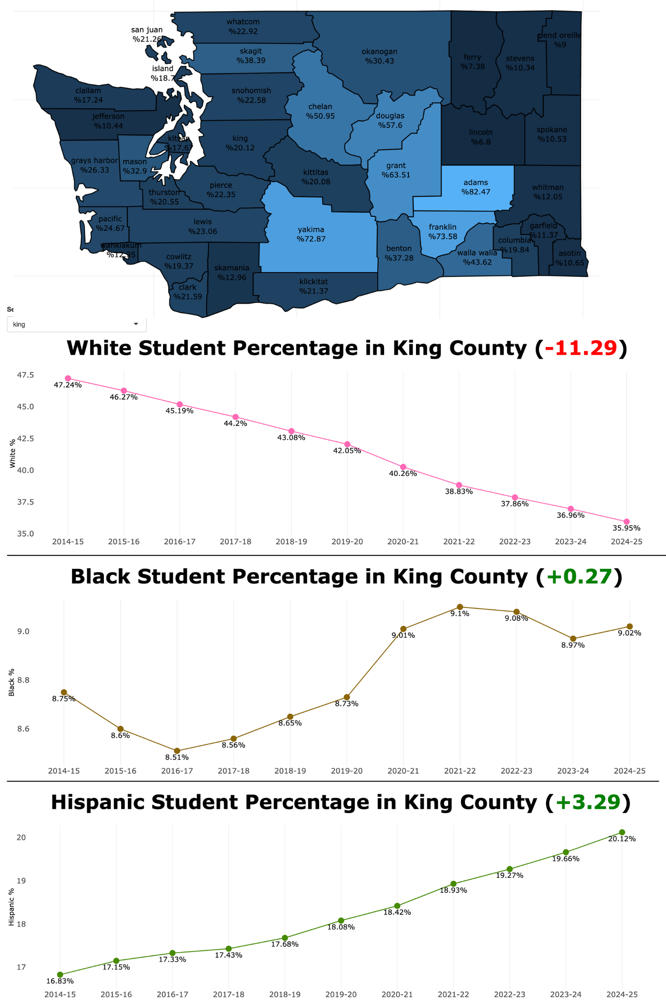

<h1>Student Demographics in Washington: A Visual Analysis - <a href="https://moriojac.shinyapps.io/wa_app/">Project Link</a> </h1>

<h2>Description</h2>
This project visualizes the student population distribution across counties in Washington State, categorized by race and year. Using interactive maps and graphs, it highlights demographic trends overtime, providing a clear view of shifts in enrollment figures among different racial groups across different counties in Washington State, ultimately aiding in educational insights and policy decisions.  
 

<h2>Languages and Utilities Used</h2>

- <b>R</b> 
- <b>ggplot</b>
- <b>Shiny</b>

  

  <h1>Project Process</h1>

<table width="100%" style="table-layout: fixed;">
  <tr>
    <td align="center" valign="top" width="25%">
      

        
        <b>Data Collection</b>
         
        <h6 style="text-align: center; min-height: 150px; font-size: 2px;">
          For this project, enrollment data was sourced from the official Washington State Student Report Card, spanning school years from 2014–2015 through 2024–2025.
             Data was provided by data.wa.gov - the official Washington state open data portal. 
             <a href="https://data.wa.gov/education/Report-Card-Enrollment-from-2014-15-to-Current-Yea/rxjk-6ieq/about_data">Washington State Student Enrollment Report Card</a>
        </h6>
      

    </td>
    <td align="center" valign="top" width="25%">
      

        
        <b>Data Cleaning and Preparation</b>
        <h6 style="text-align: center; min-height: 150px;">
          - Removing Unnecessary Columns: Duplicate and irrelevant columns were dropped.
            - Grouping Dataset: Dataset was grouped by county and school year, preparing the data for summary operations within each county–school year combination.
            - Summarizing Dataset: Calculated and assigned the population percentage of each ethnic group for each county–school year combination.
            - Merging Datasets: Merged the dataset to include the geographic coordinates of each county to enable map visualization
        </h6>
      

    </td>
    <td align="center" valign="top" width="25%">
      

        
        <b>Data Visualization & Storytelling</b>
        <h6 style="text-align: center; min-height: 150px;">
          Data is manipulated into several visualizations, categorized into three sections:
            - Injury Visualization: Providing a comprehensive view of injuries sustained.
            - Change Over Time: Revealing injury growth, pointing to the need for better injury prevention.
            - Contrast: Identifying injury risks based on physical attributes and performance metrics.
        </h6>
      

    </td>
    <td align="center" valign="top" width="25%">
      

        
        <b>Interpretation & Decision-Making</b>
        <h6 style="text-align: center; min-height: 150px;">
          The goal of this data is to offer insights that assist professionals in injury prevention, allowing the reader to interpret and make decisions based on the findings.
            Insights from the data can help teams develop targeted injury prevention strategies, such as load management for high-minute players and conditioning/workout programs based on position-             specific vulnerabilities.
        </h6>
      

    </td>
  </tr>
</table>
